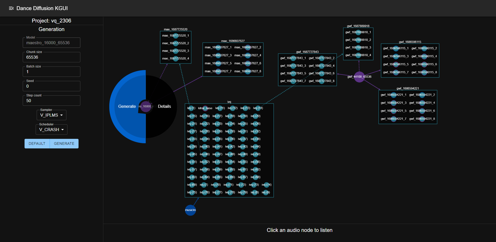

# sample-diffusion-kgui
A knowledge graph ui and logging system for Dance Diffusion models based on the sample-diffusion cli

The motivation is both to make an interactive ui for using dd models and provide a tool to curate datasets for fine-tuning. The point of mapping data points to a knowledge graph is to keep track of all the relationships between them and make it easier to do any RLHF-related stuff you can imagine like adding tags/captions, ranking samples in a batch, describing the transformation of a sample during variation or manual editing, etc.

This is an early prototype, so expect bugs and major changes

## Overview

Right-clicking on the graph view and its elements will bring up a radial context menu.
Elements can be dragged around and automatically arranged using [fCoSE](https://github.com/iVis-at-Bilkent/cytoscape.js-fcose)
- Purple nodes: models
- Cyan nodes: audio samples
- Boxes: output batches
- Blue nodes: External audio source directory
- Arrows: generation (dashed lines are for variation - purple from the model and blue from the audio source)


## Features

- Dance diffusion generation and variation
- Models, external sources, and audio files represented as interactive nodes
- Audio can be played from the ui
- Samples can be tagged, rated, and captioned
- Batches/datasets can be collapsed

## Planned features

- Additional inference modes (interpolation, inpainting, etc)
- Search and filter
- Export filtered datasets for fine-tuning
- Representation of custom processes
- Training of auxilliary models for reinforcement learning with human feedback

## Installation

### Requirements
- [git](https://git-scm.com/downloads) (to clone the repo)
- [conda](https://docs.conda.io/en/latest/) (to set up the python environment)
- [sample-diffusion](https://github.com/sudosilico/sample-diffusion)
- [npm](https://docs.npmjs.com/downloading-and-installing-node-js-and-npm)

### Set up sample-diffusion

Follow the instructions to install sample-diffusion

Activate the conda env:

```sh
conda activate dd
```
Navigate to the sample-diffusion and install it using pip:

```sh
pip install --editable
```

### Clone sample-diffusion-kgui and install additional python packages

```sh
git clone https://github.com/Bikecicle/sample-diffusion-kgui
cd sample-diffusion-kgui
pip install -r requirements.txt
```

### Install js packages

```sh
cd frontend
npm install
```

## Starting

### Backend

cd to sample-diffusion-kgui and make sure you have your sample-diffusion conda env active. Then run:

```sh
flask run
```

### Frontend

cd to sample-diffusion-kgui/frontend and run:

```sh
npm run start
```

## Usage

### Getting started

- Create a new project by selecting load/create from the menu
- Import your first model by right-clicking the empty graph view and selecting "Import model"
- Add any external audio sources you want using "Add exteral source" given a source directory, any subdirectories will be represented as "audio set" nodes in the graph

### Inference

- Right-clicking a model will bring up an option to use it for generating a batch
- Right-clicking an audio node will allow you to use it as a source for variation
